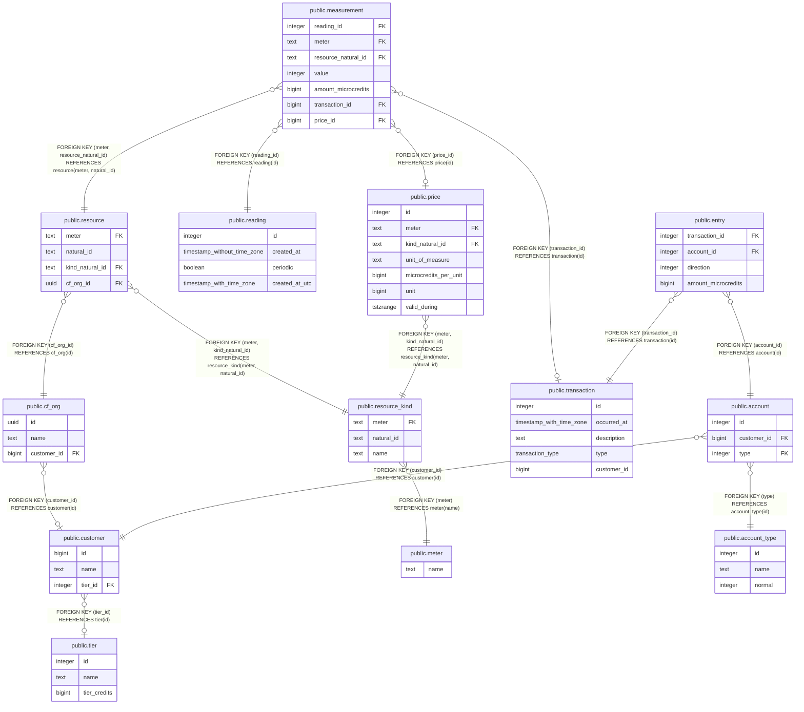

# billing

## Tables

| Name | Columns | Comment | Type |
| ---- | ------- | ------- | ---- |
| [public.tier](public.tier.md) | 3 |  | BASE TABLE |
| [public.customer](public.customer.md) | 3 |  | BASE TABLE |
| [public.cf_org](public.cf_org.md) | 3 |  | BASE TABLE |
| [public.meter](public.meter.md) | 1 | A Meter reads usage information from a system in Cloud.gov. It also namespaces natural IDs for resources and resource_kinds; meter + natural_id is a primary key. | BASE TABLE |
| [public.resource_kind](public.resource_kind.md) | 3 | ResourceKind represents a particular kind of billable resource. Note that natural_id can be empty because some meters may only read one kind of resource, and that resource kind may not have a unique identifier in the target system; it is uniquely identified by the meter name only. | BASE TABLE |
| [public.resource](public.resource.md) | 4 |  | BASE TABLE |
| [public.reading](public.reading.md) | 4 |  | BASE TABLE |
| [public.measurement](public.measurement.md) | 7 |  | BASE TABLE |
| [public.account_type](public.account_type.md) | 3 |  | BASE TABLE |
| [public.account](public.account.md) | 3 |  | BASE TABLE |
| [public.transaction](public.transaction.md) | 5 |  | BASE TABLE |
| [public.entry](public.entry.md) | 4 |  | BASE TABLE |
| [public.price](public.price.md) | 7 |  | BASE TABLE |

## Stored procedures and functions

| Name | ReturnType | Arguments | Type |
| ---- | ------- | ------- | ---- |
| public.assert_transaction_balances | trigger |  | FUNCTION |
| public.bounds_month_prev | record | as_of timestamp with time zone DEFAULT now(), tz text DEFAULT 'America/New_York'::text | FUNCTION |
| public.update_measurement_microcredits | int8 | as_of timestamp with time zone DEFAULT now() | FUNCTION |
| public.post_usage | int4 | as_of timestamp with time zone DEFAULT now() | FUNCTION |

## Enums

| Name | Values |
| ---- | ------- |
| public.river_job_state | available, cancelled, completed, discarded, pending, retryable, running, scheduled |
| public.transaction_type | iaa_pop_end, iaa_pop_start, usage_post |

## Relations

---

> Generated by [tbls](https://github.com/k1LoW/tbls)
