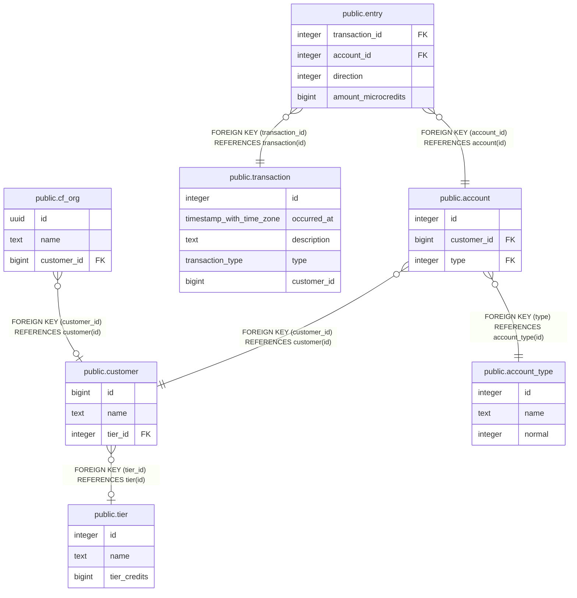

# public.account

## Description

## Columns

| Name | Type | Default | Nullable | Children | Parents | Comment |
| ---- | ---- | ------- | -------- | -------- | ------- | ------- |
| id | integer | nextval('account_id_seq'::regclass) | false | [public.entry](public.entry.md) |  |  |
| customer_id | bigint |  | false |  | [public.customer](public.customer.md) |  |
| type | integer |  | false |  | [public.account_type](public.account_type.md) |  |

## Constraints

| Name | Type | Definition |
| ---- | ---- | ---------- |
| fk_customer_id | FOREIGN KEY | FOREIGN KEY (customer_id) REFERENCES customer(id) |
| fk_type_id | FOREIGN KEY | FOREIGN KEY (type) REFERENCES account_type(id) |
| account_pkey | PRIMARY KEY | PRIMARY KEY (id) |

## Indexes

| Name | Definition |
| ---- | ---------- |
| account_pkey | CREATE UNIQUE INDEX account_pkey ON public.account USING btree (id) |
| account_unique | CREATE UNIQUE INDEX account_unique ON public.account USING btree (id, type) |
| account_customer_type_idx | CREATE INDEX account_customer_type_idx ON public.account USING btree (customer_id, type) |

## Relations

---

> Generated by [tbls](https://github.com/k1LoW/tbls)
