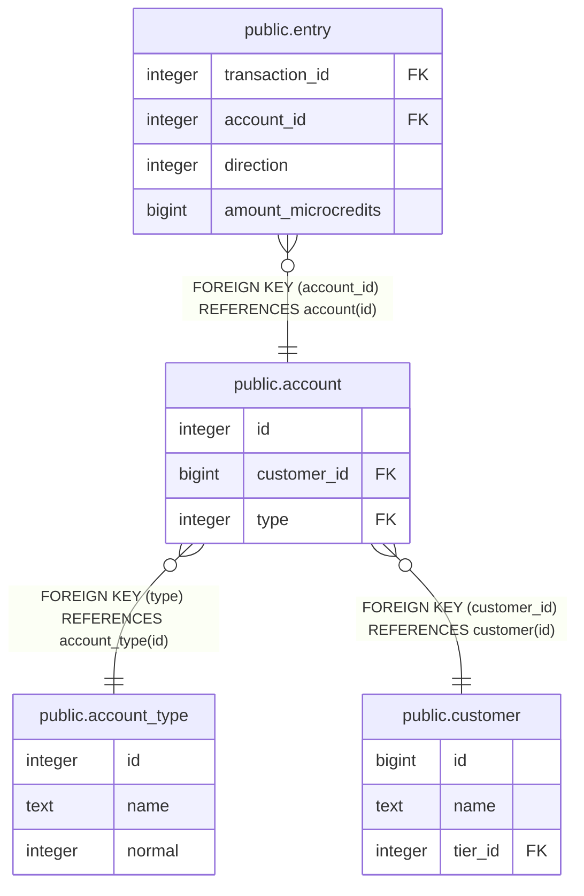

# public.account_type

## Description

## Columns

| Name | Type | Default | Nullable | Children | Parents | Comment |
| ---- | ---- | ------- | -------- | -------- | ------- | ------- |
| id | integer |  | false | [public.account](public.account.md) |  |  |
| name | text |  | false |  |  |  |
| normal | integer |  | true |  |  |  |

## Constraints

| Name | Type | Definition |
| ---- | ---- | ---------- |
| account_type_pkey | PRIMARY KEY | PRIMARY KEY (id) |

## Indexes

| Name | Definition |
| ---- | ---------- |
| account_type_pkey | CREATE UNIQUE INDEX account_type_pkey ON public.account_type USING btree (id) |
| account_type_name_uidx | CREATE UNIQUE INDEX account_type_name_uidx ON public.account_type USING btree (name) |

## Relations

---

> Generated by [tbls](https://github.com/k1LoW/tbls)
