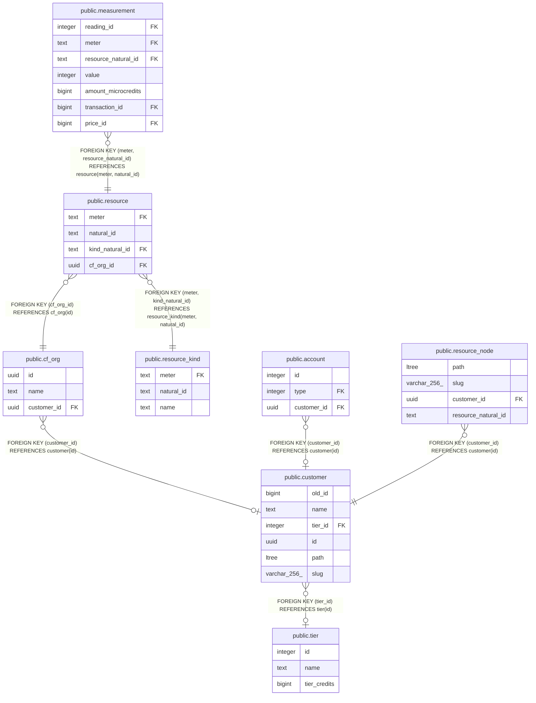

# public.cf_org

## Description

## Columns

| Name | Type | Default | Nullable | Children | Parents | Comment |
| ---- | ---- | ------- | -------- | -------- | ------- | ------- |
| id | uuid |  | false | [public.resource](public.resource.md) |  |  |
| name | text |  | true |  |  |  |
| customer_id | uuid |  | true |  | [public.customer](public.customer.md) |  |

## Constraints

| Name | Type | Definition |
| ---- | ---- | ---------- |
| cf_org_pkey | PRIMARY KEY | PRIMARY KEY (id) |
| fk_customer_id | FOREIGN KEY | FOREIGN KEY (customer_id) REFERENCES customer(id) |

## Indexes

| Name | Definition |
| ---- | ---------- |
| cf_org_pkey | CREATE UNIQUE INDEX cf_org_pkey ON public.cf_org USING btree (id) |
| cf_org_customer_id_idx | CREATE INDEX cf_org_customer_id_idx ON public.cf_org USING btree (customer_id) |

## Relations

---

> Generated by [tbls](https://github.com/k1LoW/tbls)
