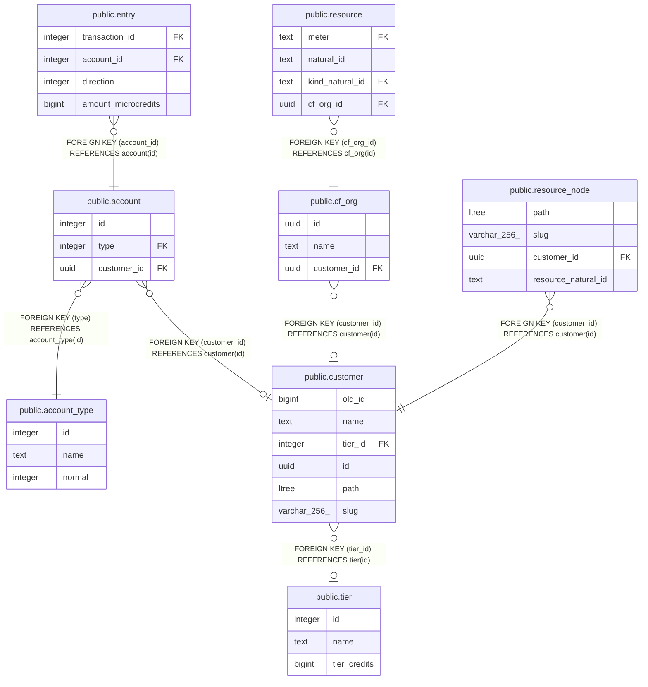

# public.customer

## Description

## Columns

| Name | Type | Default | Nullable | Children | Parents | Comment |
| ---- | ---- | ------- | -------- | -------- | ------- | ------- |
| old_id | bigint | nextval('customer_id_seq'::regclass) | false |  |  |  |
| name | text |  | false |  |  |  |
| tier_id | integer |  | true |  | [public.tier](public.tier.md) |  |
| id | uuid | uuid_generate_v7() | false | [public.cf_org](public.cf_org.md) [public.account](public.account.md) [public.resource_node](public.resource_node.md) |  |  |
| path | ltree |  | true |  |  |  |
| slug | varchar(256) |  | true |  |  |  |

## Constraints

| Name | Type | Definition |
| ---- | ---- | ---------- |
| valid_path | CHECK | CHECK (((path)::text ~ '^[A-Za-z0-9_]+(\.[A-Za-z0-9_]+)*$'::text)) |
| fk_tier_id | FOREIGN KEY | FOREIGN KEY (tier_id) REFERENCES tier(id) |
| customer_new_id_key | UNIQUE | UNIQUE (id) |
| customer_pkey | PRIMARY KEY | PRIMARY KEY (id) |
| customer_old_id_key | UNIQUE | UNIQUE (old_id) |

## Indexes

| Name | Definition |
| ---- | ---------- |
| customer_new_id_key | CREATE UNIQUE INDEX customer_new_id_key ON public.customer USING btree (id) |
| customer_pkey | CREATE UNIQUE INDEX customer_pkey ON public.customer USING btree (id) |
| customer_old_id_key | CREATE UNIQUE INDEX customer_old_id_key ON public.customer USING btree (old_id) |
| customer_path_gist_idx | CREATE INDEX customer_path_gist_idx ON public.customer USING gist (path) |
| customer_path_btree_idx | CREATE INDEX customer_path_btree_idx ON public.customer USING btree (path) |

## Relations

---

> Generated by [tbls](https://github.com/k1LoW/tbls)
