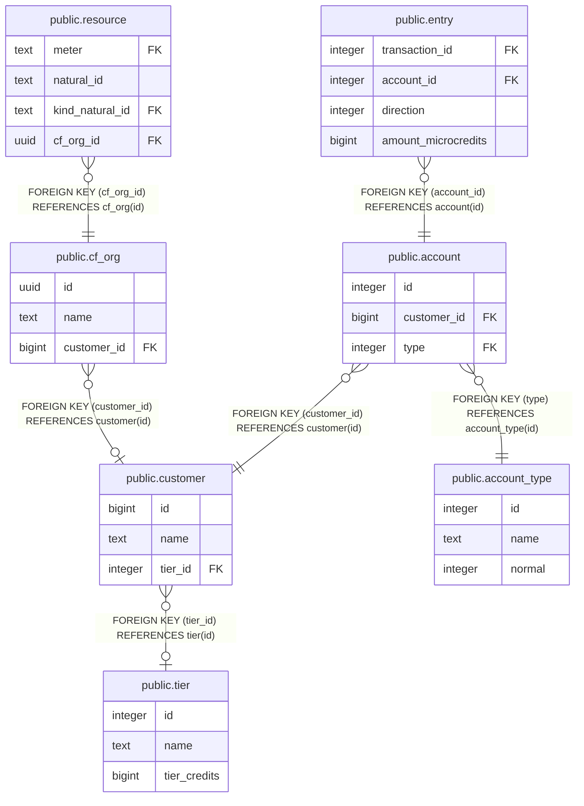

# public.customer

## Description

## Columns

| Name | Type | Default | Nullable | Children | Parents | Comment |
| ---- | ---- | ------- | -------- | -------- | ------- | ------- |
| id | bigint | nextval('customer_id_seq'::regclass) | false | [public.cf_org](public.cf_org.md) [public.account](public.account.md) |  |  |
| name | text |  | false |  |  |  |
| tier_id | integer |  | true |  | [public.tier](public.tier.md) |  |

## Constraints

| Name | Type | Definition |
| ---- | ---- | ---------- |
| fk_tier_id | FOREIGN KEY | FOREIGN KEY (tier_id) REFERENCES tier(id) |
| customer_pkey | PRIMARY KEY | PRIMARY KEY (id) |

## Indexes

| Name | Definition |
| ---- | ---------- |
| customer_pkey | CREATE UNIQUE INDEX customer_pkey ON public.customer USING btree (id) |

## Relations

---

> Generated by [tbls](https://github.com/k1LoW/tbls)
