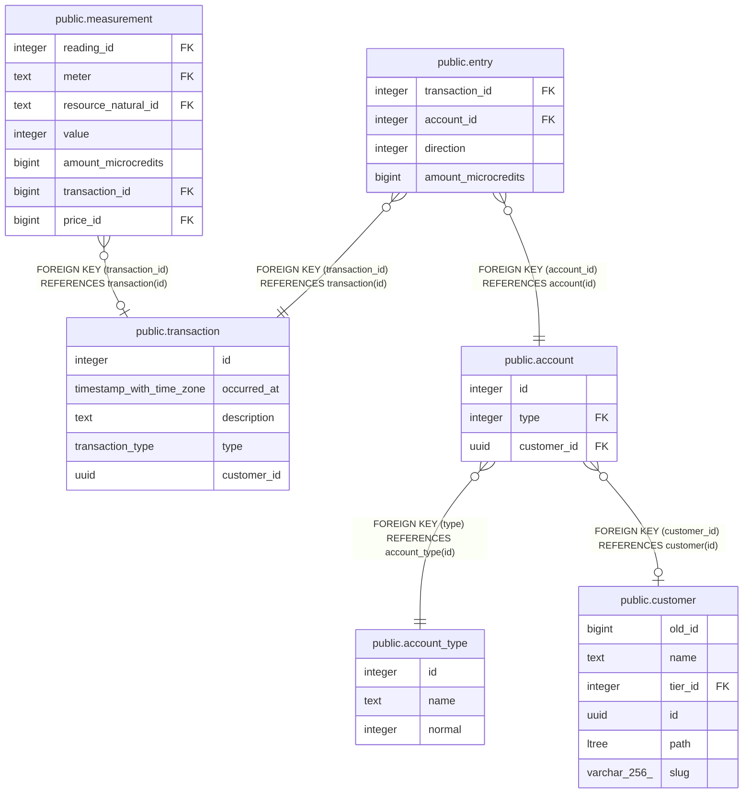

# public.entry

## Description

## Columns

| Name | Type | Default | Nullable | Children | Parents | Comment |
| ---- | ---- | ------- | -------- | -------- | ------- | ------- |
| transaction_id | integer |  | false |  | [public.transaction](public.transaction.md) |  |
| account_id | integer |  | false |  | [public.account](public.account.md) |  |
| direction | integer |  | false |  |  |  |
| amount_microcredits | bigint |  | true |  |  |  |

## Constraints

| Name | Type | Definition |
| ---- | ---- | ---------- |
| transaction_balances_chk | TRIGGER | CREATE CONSTRAINT TRIGGER transaction_balances_chk AFTER INSERT OR DELETE OR UPDATE ON public.entry DEFERRABLE INITIALLY DEFERRED FOR EACH ROW EXECUTE FUNCTION assert_transaction_balances() |
| fk_account_id | FOREIGN KEY | FOREIGN KEY (account_id) REFERENCES account(id) |
| entry_transaction_id_fkey | FOREIGN KEY | FOREIGN KEY (transaction_id) REFERENCES transaction(id) |
| entry_pkey | PRIMARY KEY | PRIMARY KEY (transaction_id, account_id) |

## Indexes

| Name | Definition |
| ---- | ---------- |
| entry_pkey | CREATE UNIQUE INDEX entry_pkey ON public.entry USING btree (transaction_id, account_id) |

## Triggers

| Name | Definition |
| ---- | ---------- |
| transaction_balances_chk | CREATE CONSTRAINT TRIGGER transaction_balances_chk AFTER INSERT OR DELETE OR UPDATE ON public.entry DEFERRABLE INITIALLY DEFERRED FOR EACH ROW EXECUTE FUNCTION assert_transaction_balances() |

## Relations

---

> Generated by [tbls](https://github.com/k1LoW/tbls)
