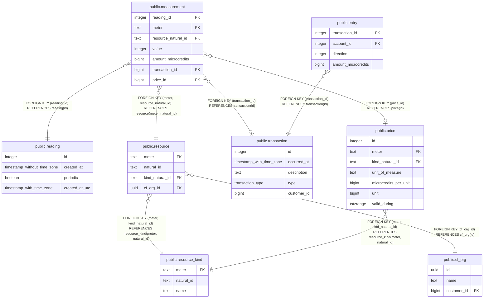

# public.measurement

## Description

## Columns

| Name | Type | Default | Nullable | Children | Parents | Comment |
| ---- | ---- | ------- | -------- | -------- | ------- | ------- |
| reading_id | integer |  | false |  | [public.reading](public.reading.md) |  |
| meter | text |  | false |  | [public.resource](public.resource.md) |  |
| resource_natural_id | text |  | false |  | [public.resource](public.resource.md) |  |
| value | integer |  | false |  |  |  |
| amount_microcredits | bigint |  | true |  |  | AmountMicrocredits is a denormalized column that is calculated from the Price of the ResourceKind that was applicable when the measurement was taken (based on the time of the Reading). The value is persisted here for simpler rollups and auditing. |
| transaction_id | bigint |  | true |  | [public.transaction](public.transaction.md) | TransactionID is the transaction that accounts for this usage, typically a "post usage" transaction. |
| price_id | bigint |  | true |  | [public.price](public.price.md) |  |

## Constraints

| Name | Type | Definition |
| ---- | ---- | ---------- |
| fk_resource_id | FOREIGN KEY | FOREIGN KEY (meter, resource_natural_id) REFERENCES resource(meter, natural_id) |
| fk_reading_id | FOREIGN KEY | FOREIGN KEY (reading_id) REFERENCES reading(id) |
| fk_transaction | FOREIGN KEY | FOREIGN KEY (transaction_id) REFERENCES transaction(id) |
| fk_price | FOREIGN KEY | FOREIGN KEY (price_id) REFERENCES price(id) |

## Indexes

| Name | Definition |
| ---- | ---------- |
| measurement_reading_id_idx | CREATE INDEX measurement_reading_id_idx ON public.measurement USING btree (reading_id) |
| measurement_meter_resource_natural_idx | CREATE INDEX measurement_meter_resource_natural_idx ON public.measurement USING btree (meter, resource_natural_id) |

## Relations

---

> Generated by [tbls](https://github.com/k1LoW/tbls)
