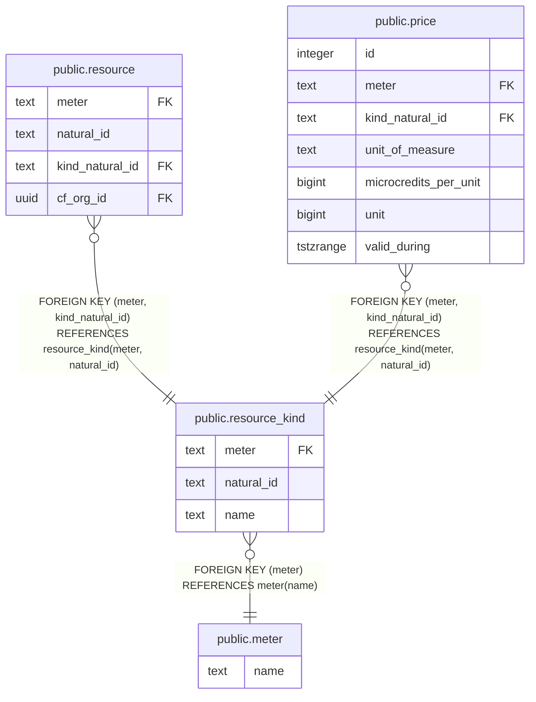

# public.meter

## Description

A Meter reads usage information from a system in Cloud.gov. It also namespaces natural IDs for resources and resource_kinds; meter + natural_id is a primary key.

## Columns

| Name | Type | Default | Nullable | Children | Parents | Comment |
| ---- | ---- | ------- | -------- | -------- | ------- | ------- |
| name | text |  | false | [public.resource_kind](public.resource_kind.md) |  |  |

## Constraints

| Name | Type | Definition |
| ---- | ---- | ---------- |
| meter_name_check | CHECK | CHECK ((char_length(TRIM(BOTH FROM name)) > 0)) |
| meter_name_key | UNIQUE | UNIQUE (name) |

## Indexes

| Name | Definition |
| ---- | ---------- |
| meter_name_key | CREATE UNIQUE INDEX meter_name_key ON public.meter USING btree (name) |

## Relations

---

> Generated by [tbls](https://github.com/k1LoW/tbls)
