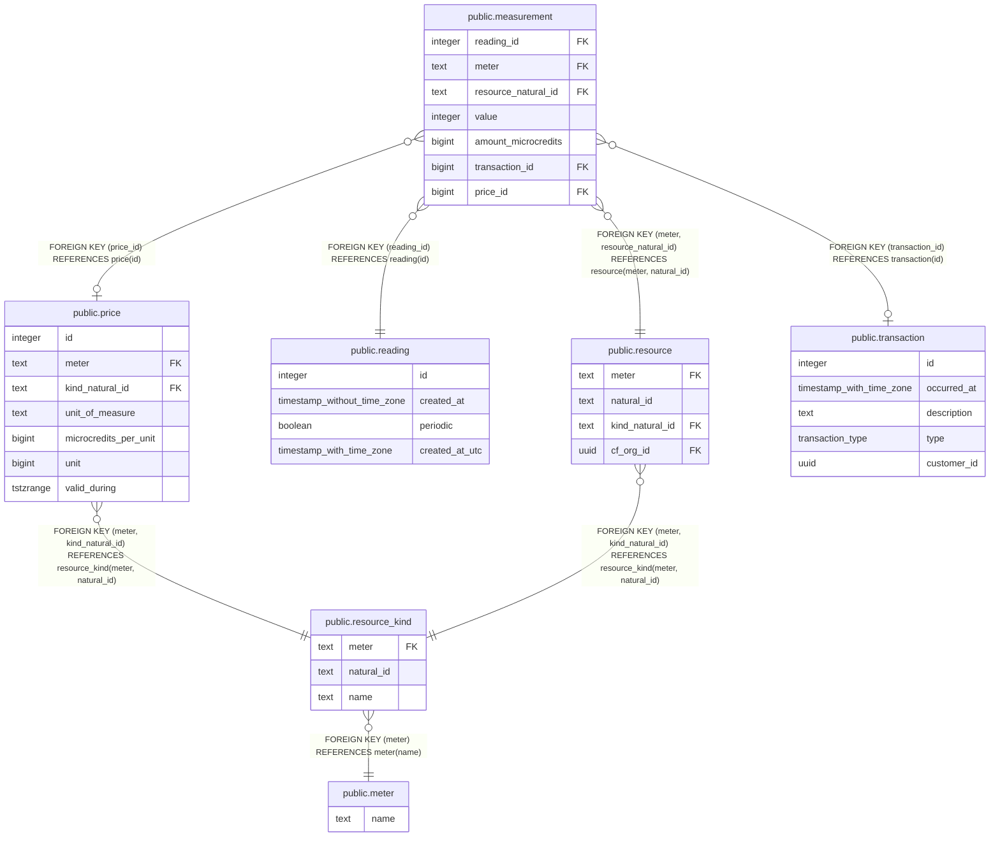

# public.price

## Description

## Columns

| Name | Type | Default | Nullable | Children | Parents | Comment |
| ---- | ---- | ------- | -------- | -------- | ------- | ------- |
| id | integer | nextval('price_id_seq'::regclass) | false | [public.measurement](public.measurement.md) |  |  |
| meter | text |  | false |  | [public.resource_kind](public.resource_kind.md) |  |
| kind_natural_id | text |  | false |  | [public.resource_kind](public.resource_kind.md) |  |
| unit_of_measure | text |  | false |  |  |  |
| microcredits_per_unit | bigint |  | false |  |  |  |
| unit | bigint |  | false |  |  |  |
| valid_during | tstzrange |  | false |  |  |  |

## Constraints

| Name | Type | Definition |
| ---- | ---- | ---------- |
| fk_resource_kind | FOREIGN KEY | FOREIGN KEY (meter, kind_natural_id) REFERENCES resource_kind(meter, natural_id) |
| price_pkey | PRIMARY KEY | PRIMARY KEY (id) |

## Indexes

| Name | Definition |
| ---- | ---------- |
| price_pkey | CREATE UNIQUE INDEX price_pkey ON public.price USING btree (id) |

## Relations

---

> Generated by [tbls](https://github.com/k1LoW/tbls)
