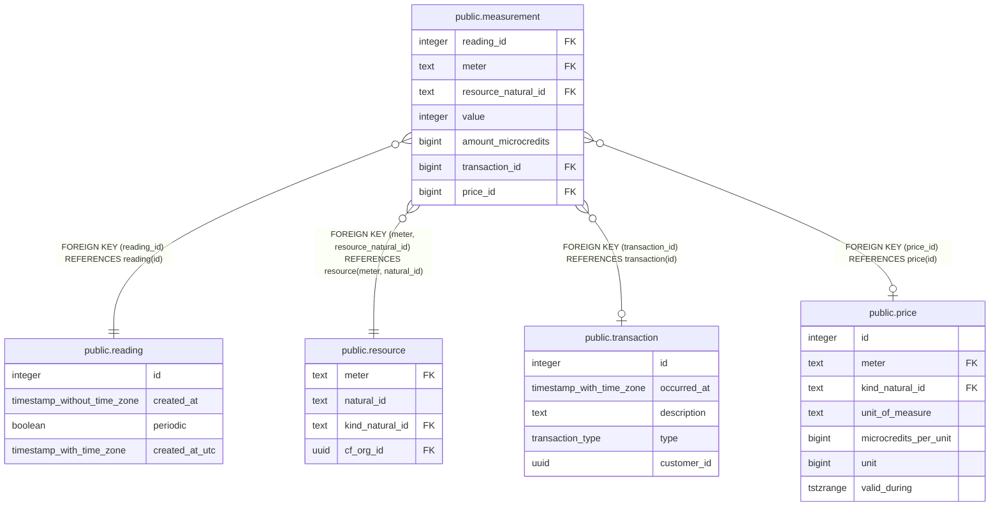

# public.reading

## Description

## Columns

| Name | Type | Default | Nullable | Extra Definition | Children | Parents | Comment |
| ---- | ---- | ------- | -------- | ---------------- | -------- | ------- | ------- |
| id | integer | nextval('reading_id_seq'::regclass) | false |  | [public.measurement](public.measurement.md) |  |  |
| created_at | timestamp without time zone |  | false |  |  |  | CreatedAt must be a time in UTC. |
| periodic | boolean |  | false |  |  |  | Periodic is true if a reading was taken automatically as part of the periodic usage measurement schedule, or false if it was requested manually. |
| created_at_utc | timestamp with time zone |  | true | GENERATED ALWAYS AS (created_at AT TIME ZONE 'UTC'::text) STORED |  |  | CreatedAtUTC supplements CreatedAt, which does not have a timezone. Values must be inserted into CreatedAt in UTC by the client. CreatedAt has a unique index on it to enforce readings being taken at most hourly. Because the index uses functions that are not volatility level IMMUTABLE, it cannot be used on a column with a timezone; hence the supplementary generated column. |

## Constraints

| Name | Type | Definition |
| ---- | ---- | ---------- |
| reading_pkey | PRIMARY KEY | PRIMARY KEY (id) |

## Indexes

| Name | Definition | Comment |
| ---- | ---------- | ------- |
| reading_pkey | CREATE UNIQUE INDEX reading_pkey ON public.reading USING btree (id) |  |
| idx_reading_created_at | CREATE INDEX idx_reading_created_at ON public.reading USING btree (created_at) |  |
| reading_hourly_uq | CREATE UNIQUE INDEX reading_hourly_uq ON public.reading USING btree (date_trunc('hour'::text, created_at)) | Make readings unique per hour. |
| reading_created_at_idx | CREATE INDEX reading_created_at_idx ON public.reading USING btree (created_at) |  |
| reading_created_at_utc_idx | CREATE INDEX reading_created_at_utc_idx ON public.reading USING btree (created_at_utc) |  |

## Relations

---

> Generated by [tbls](https://github.com/k1LoW/tbls)
