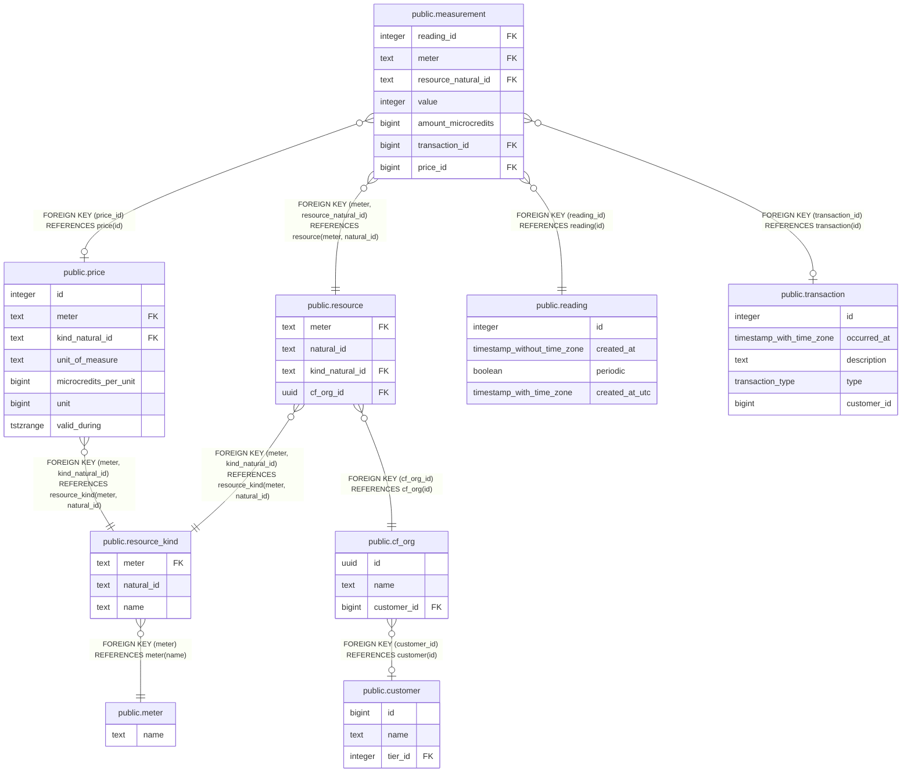

# public.resource

## Description

## Columns

| Name | Type | Default | Nullable | Children | Parents | Comment |
| ---- | ---- | ------- | -------- | -------- | ------- | ------- |
| meter | text |  | false | [public.measurement](public.measurement.md) | [public.resource_kind](public.resource_kind.md) |  |
| natural_id | text |  | false | [public.measurement](public.measurement.md) |  |  |
| kind_natural_id | text |  | false |  | [public.resource_kind](public.resource_kind.md) |  |
| cf_org_id | uuid |  | false |  | [public.cf_org](public.cf_org.md) |  |

## Constraints

| Name | Type | Definition |
| ---- | ---- | ---------- |
| fk_cf_org_id | FOREIGN KEY | FOREIGN KEY (cf_org_id) REFERENCES cf_org(id) |
| fk_cf_kind_id | FOREIGN KEY | FOREIGN KEY (meter, kind_natural_id) REFERENCES resource_kind(meter, natural_id) |
| resource_pkey | PRIMARY KEY | PRIMARY KEY (meter, natural_id) |
| resource_meter_natural_id_uq | UNIQUE | UNIQUE (meter, natural_id) |

## Indexes

| Name | Definition | Comment |
| ---- | ---------- | ------- |
| resource_pkey | CREATE UNIQUE INDEX resource_pkey ON public.resource USING btree (meter, natural_id) |  |
| resource_meter_natural_id_uq | CREATE UNIQUE INDEX resource_meter_natural_id_uq ON public.resource USING btree (meter, natural_id) |  |
| idx_resource_meter_natural_id | CREATE UNIQUE INDEX idx_resource_meter_natural_id ON public.resource USING btree (meter, natural_id) | Enables efficient deduplicated inserts using BulkCreateResources function. |
| resource_cf_org_id_idx | CREATE INDEX resource_cf_org_id_idx ON public.resource USING btree (cf_org_id) |  |

## Relations

---

> Generated by [tbls](https://github.com/k1LoW/tbls)
