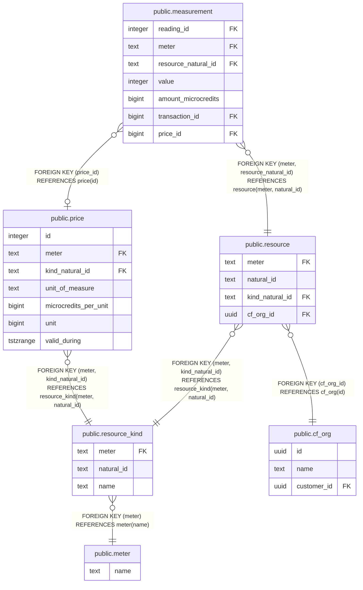

# public.resource_kind

## Description

ResourceKind represents a particular kind of billable resource. Note that natural_id can be empty because some meters may only read one kind of resource, and that resource kind may not have a unique identifier in the target system; it is uniquely identified by the meter name only.

## Columns

| Name | Type | Default | Nullable | Children | Parents | Comment |
| ---- | ---- | ------- | -------- | -------- | ------- | ------- |
| meter | text |  | false | [public.resource](public.resource.md) [public.price](public.price.md) | [public.meter](public.meter.md) |  |
| natural_id | text |  | false | [public.resource](public.resource.md) [public.price](public.price.md) |  |  |
| name | text |  | true |  |  |  |

## Constraints

| Name | Type | Definition |
| ---- | ---- | ---------- |
| fk_meter | FOREIGN KEY | FOREIGN KEY (meter) REFERENCES meter(name) |
| resource_kind_pkey | PRIMARY KEY | PRIMARY KEY (meter, natural_id) |

## Indexes

| Name | Definition | Comment |
| ---- | ---------- | ------- |
| resource_kind_pkey | CREATE UNIQUE INDEX resource_kind_pkey ON public.resource_kind USING btree (meter, natural_id) |  |
| idx_resource_kind_meter_natural_id | CREATE UNIQUE INDEX idx_resource_kind_meter_natural_id ON public.resource_kind USING btree (meter, natural_id) | Enables efficient deduplicated inserts using BulkCreateResourceKinds function. |

## Relations

---

> Generated by [tbls](https://github.com/k1LoW/tbls)
