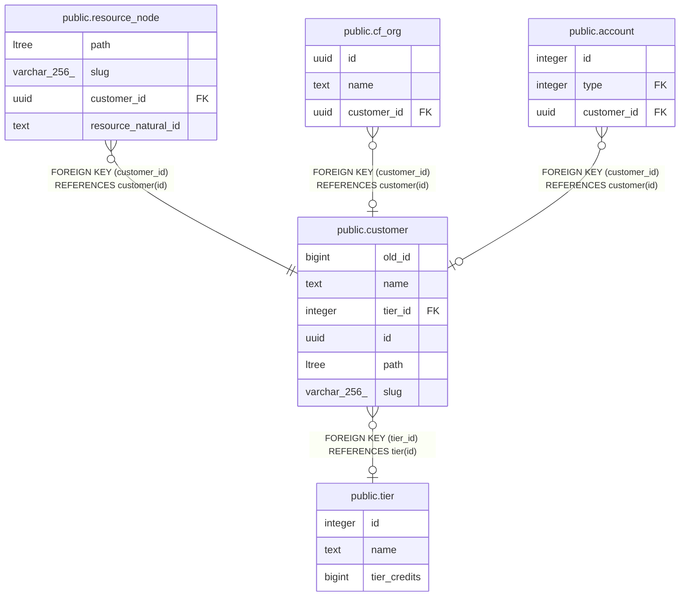

# public.resource_node

## Description

## Columns

| Name | Type | Default | Nullable | Children | Parents | Comment |
| ---- | ---- | ------- | -------- | -------- | ------- | ------- |
| path | ltree |  | true |  |  |  |
| slug | varchar(256) |  | true |  |  |  |
| customer_id | uuid |  | false |  | [public.customer](public.customer.md) |  |
| resource_natural_id | text |  | false |  |  |  |

## Constraints

| Name | Type | Definition |
| ---- | ---- | ---------- |
| valid_path | CHECK | CHECK (((path)::text ~ '^[A-Za-z0-9_]+(\.[A-Za-z0-9_]+)*$'::text)) |
| resource_node_customer_id_fkey | FOREIGN KEY | FOREIGN KEY (customer_id) REFERENCES customer(id) |
| resource_node_pkey | PRIMARY KEY | PRIMARY KEY (customer_id, resource_natural_id) |
| resource_node_path_uq | UNIQUE | UNIQUE (customer_id, path) |

## Indexes

| Name | Definition |
| ---- | ---------- |
| resource_node_pkey | CREATE UNIQUE INDEX resource_node_pkey ON public.resource_node USING btree (customer_id, resource_natural_id) |
| resource_path_gist_idx | CREATE INDEX resource_path_gist_idx ON public.resource_node USING gist (path) |
| resource_path_btree_idx | CREATE INDEX resource_path_btree_idx ON public.resource_node USING btree (path) |
| customer_path_idx | CREATE INDEX customer_path_idx ON public.resource_node USING btree (customer_id, path) |
| resource_node_path_uq | CREATE UNIQUE INDEX resource_node_path_uq ON public.resource_node USING btree (customer_id, path) |

## Relations

---

> Generated by [tbls](https://github.com/k1LoW/tbls)
