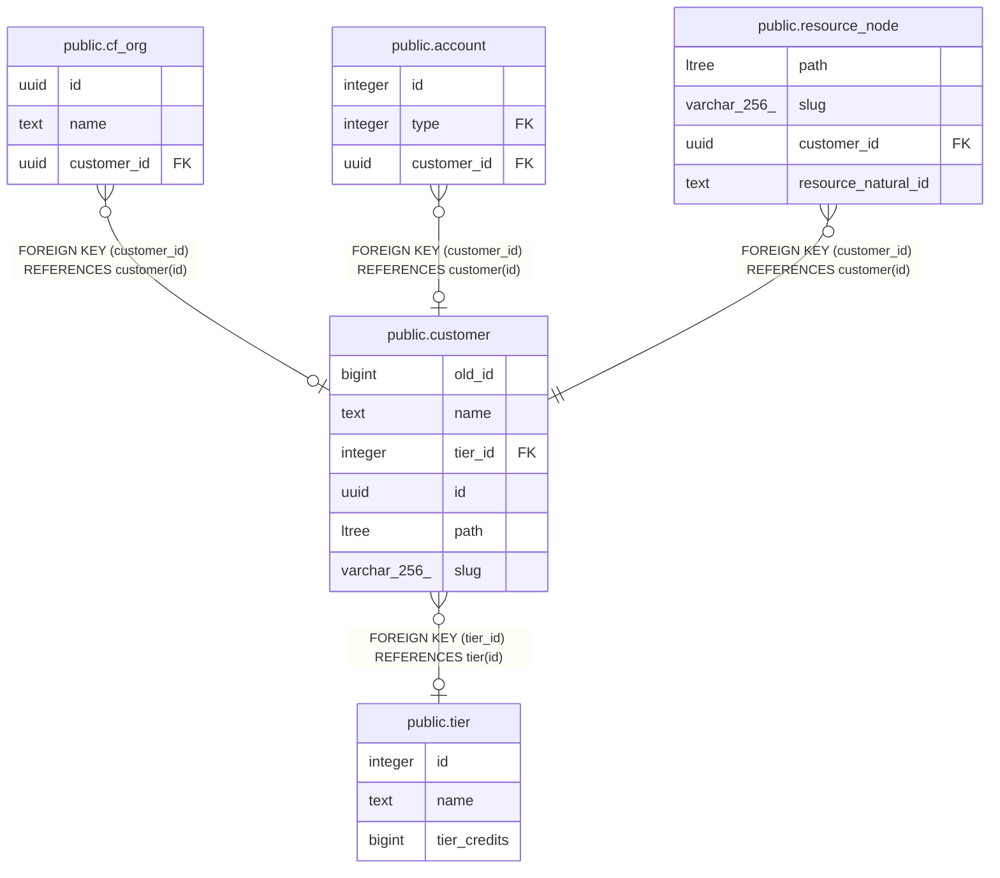

# public.tier

## Description

## Columns

| Name | Type | Default | Nullable | Children | Parents | Comment |
| ---- | ---- | ------- | -------- | -------- | ------- | ------- |
| id | integer | nextval('tier_id_seq'::regclass) | false | [public.customer](public.customer.md) |  |  |
| name | text |  | false |  |  |  |
| tier_credits | bigint |  | false |  |  |  |

## Constraints

| Name | Type | Definition |
| ---- | ---- | ---------- |
| tier_pkey | PRIMARY KEY | PRIMARY KEY (id) |

## Indexes

| Name | Definition |
| ---- | ---------- |
| tier_pkey | CREATE UNIQUE INDEX tier_pkey ON public.tier USING btree (id) |

## Relations

---

> Generated by [tbls](https://github.com/k1LoW/tbls)
