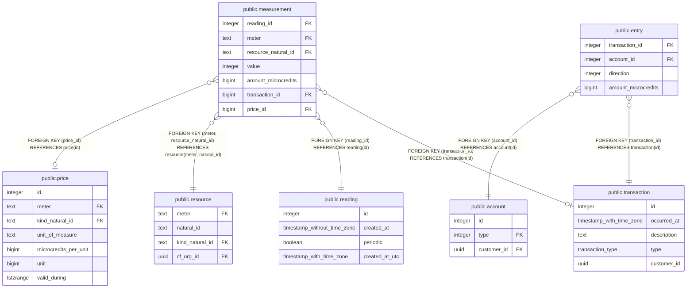

# public.transaction

## Description

## Columns

| Name | Type | Default | Nullable | Children | Parents | Comment |
| ---- | ---- | ------- | -------- | -------- | ------- | ------- |
| id | integer | nextval('transaction_id_seq'::regclass) | false | [public.measurement](public.measurement.md) [public.entry](public.entry.md) |  |  |
| occurred_at | timestamp with time zone |  | true |  |  |  |
| description | text |  | true |  |  |  |
| type | transaction_type |  | false |  |  |  |
| customer_id | uuid |  | true |  |  | CustomerID is somewhat redundant because the Entry rows associated with a Transaction are associated with Accounts, which are associated with a Customer. However, we have to create a Transaction before we create an Entry (see post_usage, ins_tx as an example). To join Measurements, Transactions, Entries, and Accounts, Transaction needs a CustomerID. |

## Constraints

| Name | Type | Definition |
| ---- | ---- | ---------- |
| transaction_pkey | PRIMARY KEY | PRIMARY KEY (id) |

## Indexes

| Name | Definition |
| ---- | ---------- |
| transaction_pkey | CREATE UNIQUE INDEX transaction_pkey ON public.transaction USING btree (id) |

## Relations

---

> Generated by [tbls](https://github.com/k1LoW/tbls)
