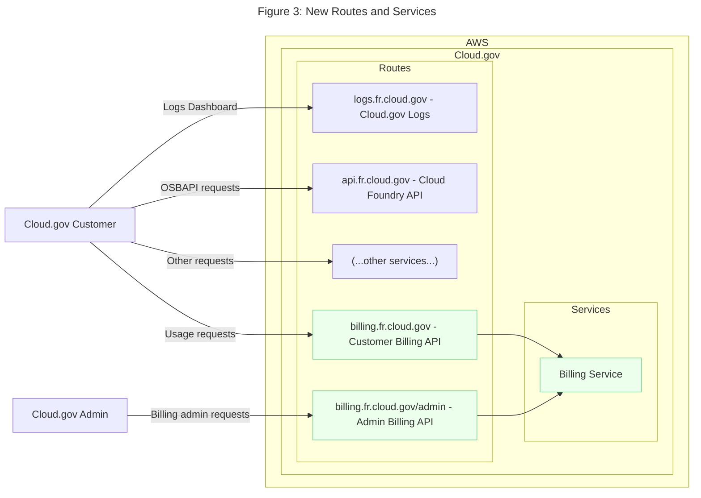

# Significant Change Request Diagrams

## New Routes and Services

```mermaid
---
title: "Figure 3: New Routes and Services"
---

flowchart LR
    classDef new fill:#ecffec,stroke:#73d893

    u["Cloud.gov Customer"]
    a["Cloud.gov Admin"]

    subgraph "AWS"

        subgraph "Cloud.gov"
            direction LR

            subgraph "Routes"
                logs["logs.fr.cloud.gov - Cloud.gov Logs"]
                capi["api.fr.cloud.gov - Cloud Foundry API"]
                etc["(...other services...)"]
                billing["billing.fr.cloud.gov - Customer Billing API"]:::new
                billing-admin["billing.fr.cloud.gov/admin - Admin Billing API"]:::new
            end

            subgraph "Services"
                billing-svc["Billing Service"]:::new
            end
        end
    end


    u -->|Logs Dashboard| logs
    u -->|Other requests| etc
    u -->|OSBAPI requests| capi
    u -->|Usage requests| billing

    a -->|Billing admin requests| billing-admin

    billing --> billing-svc
    billing-admin --> billing-svc
```
